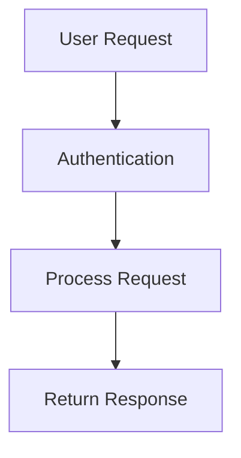
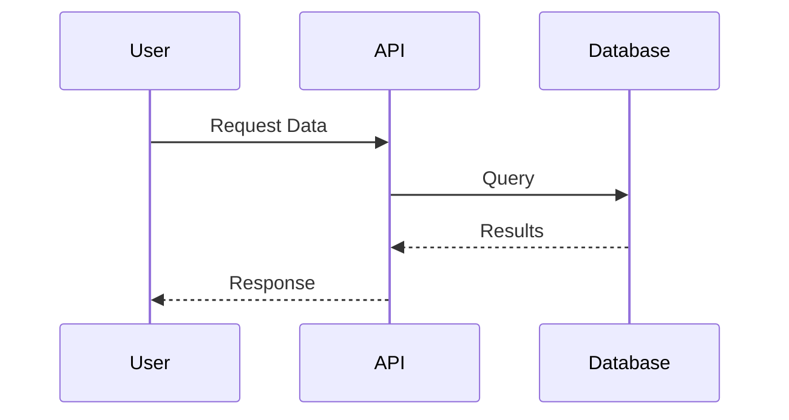

# Ariel

[](https://www.youtube.com/watch?v=SXKlJuO07eM)


This directory contains a CLI tool for compiling Mermaid diagrams to images, organized by project.

## Project Structure

```
./mermaid/
├── README.md           # This file
├── Makefile           # Main build commands
├── package.json       # Node.js dependencies
├── .nvmrc            # Node.js version requirement
├── cli.js            # CLI compilation tool
├── config.json       # Default configuration
└── projects/         # Project directories
    ├── example-project/
    │   ├── diagram1.mmd
    │   ├── diagram2.mmd
    │   └── outputs/    # Auto-generated images
    └── your-project/
        ├── architecture.mmd
        └── outputs/
```

## Prerequisites

- Node.js 18.20.0 or higher (specified in `.nvmrc`)
- npm package manager

## Quick Start

1. **Set up Node.js version** (if using nvm):
   ```bash
   nvm use
   ```

2. **Install dependencies**:
   ```bash
   make install
   ```

3. **Compile all projects**:
   ```bash
   make compile
   ```

## Usage

### Makefile Commands

The easiest way to use the tool is through the Makefile:

```bash
# Show help
make help

# Install dependencies
make install

# Compile all projects
make compile

# Compile specific project
make compile PROJECT=my-project

# Use different output format
make compile FORMAT=svg
make compile FORMAT=pdf

# Use different theme
make compile THEME=dark
make compile THEME=forest

# Combine options
make compile PROJECT=my-project FORMAT=svg THEME=dark

# Clean output directories
make clean

# Clean everything including node_modules
make clean-all
```

### Direct CLI Usage

You can also use the CLI tool directly:

```bash
# Compile all projects
node cli.js

# Compile specific project
node cli.js --project my-project

# Use different format
node cli.js --format svg

# Use different theme
node cli.js --theme dark

# Set custom dimensions
node cli.js --width 1600 --height 1200

# Show help
node cli.js --help
```

## Configuration

### Default Settings (config.json)

```json
{
  "format": "png",
  "theme": "default",
  "width": 1200,
  "height": 800,
  "backgroundColor": "white"
}
```

### Available Options

- **Formats**: `png`, `svg`, `pdf`
- **Themes**: `default`, `dark`, `forest`, `neutral`, `base`
- **Dimensions**: Custom width/height in pixels
- **Background**: Color for PNG/PDF outputs

## Creating a New Project

1. Create a new directory in `projects/`:
   ```bash
   mkdir projects/my-new-project
   ```

2. Add your Mermaid files (`.mmd` or `.mermaid` extension):
   ```bash
   touch projects/my-new-project/architecture.mmd
   ```

3. Write your Mermaid diagram:
   ```mermaid
   graph TD
       A[Start] --> B[Process]
       B --> C[End]
   ```

4. Compile:
   ```bash
   make compile PROJECT=my-new-project
   ```

## File Extensions

Supported Mermaid file extensions:
- `.mmd` (recommended)
- `.mermaid`

## Output

- Compiled images are saved in each project's `outputs/` directory
- The `outputs/` directory is automatically created if it doesn't exist
- Original filenames are preserved with the new extension (e.g., `diagram.mmd` → `diagram.png`)

## Examples

### Basic Flow Chart


### Sequence Diagram


## Troubleshooting

### Common Issues

1. **Node.js version mismatch**:
   ```bash
   nvm use  # Use the version specified in .nvmrc
   ```

2. **Missing dependencies**:
   ```bash
   make install
   ```

3. **Permission errors**:
   ```bash
   chmod +x cli.js
   ```

4. **Puppeteer issues** (headless browser for rendering):
   - The config includes puppeteer args for common environments
   - On some systems, you may need to install additional dependencies

### Getting Help

- Run `make help` for available commands
- Run `node cli.js --help` for CLI options
- Check the official [Mermaid documentation](https://mermaid.js.org/) for diagram syntax
