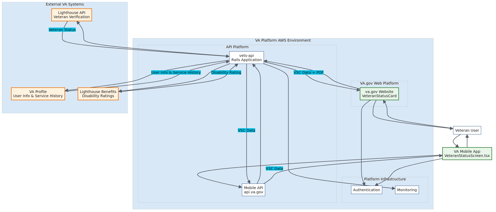

# Mobile Feature Support (MFS) Team - ATO Documentation

## Overview

This documentation package provides comprehensive ATO (Authority to Operate) boundary information for features developed by the **Mobile Feature Support (MFS)** team. 

The MFS team operates as a mercenary-style development team providing targeted feature support across the VA ecosystem, developing frontend components and API integrations that run within existing VA.gov and VA Mobile App infrastructure.

## Current Features in Scope

This documentation currently covers features that have completed the collab cycle:

### Veteran Status Card (VSC)
The Veteran Status Card feature enables Veterans to display and access a digital version of their Veteran Status Card within both the VA mobile app and va.gov website. The feature serves authenticated Veterans by displaying:

- Full name
- Latest period of service  
- DoD ID number (EDIPI)
- VA disability rating (when applicable)

*Additional features will be added to this documentation as they complete Architecture Intent review.*

## Documentation Structure

This package contains the following documentation files addressing all Platform team requirements:

### Core Documentation

| Document | Purpose | Key Information |
|----------|---------|-----------------|
| **[POC.md](./POC.md)** | Team and feature overview | MFS team scope, feature relationships, contacts, Architecture Intent status |
| **[AWS_Resources.md](./AWS_Resources.md)** | Cloud infrastructure and PII handling | Platform AWS usage, PII data types, security measures across features |
| **[Repos.md](./Repos.md)** | Repository information and access | Code repositories, team access levels, collaboration model |
| **[Tools.md](./Tools.md)** | CI/CD and deployment tools | Platform tool dependencies, deployment processes, SBOM |
| **[Connections.md](./Connections.md)** | External system integrations | API connections, downstream services, encryption details |

### Architecture Diagram

*High-level data flow showing MFS feature relationships to the Platform AWS Environment and external VA systems.*

**Diagram Source**: [Data_Flow_Diagram.mmd](./Data_Flow_Diagram.mmd)

## Key Architectural Points

### MFS Team Scope
- **Role**: Mercenary-style development team providing targeted feature support
- **Ownership**: Frontend components and API integrations only
- **Dependencies**: Relies entirely on Platform AWS infrastructure and services
- **Feature Model**: Develops features across web and mobile platforms

### Platform Integration
- **Web Platform**: Features deployed to staging.va.gov and va.gov through platform pipelines
- **Mobile Platform**: API endpoints on staging-api.va.gov and api.va.gov
- **Mobile App**: Features distributed via TestFlight/Firebase (staging) and App Stores (production)

### External System Integration Pattern
MFS features typically integrate with VA internal services including:
- **Lighthouse APIs**: Various veteran-facing services and verification
- **VA Profile Services**: User profile and demographic information
- **Benefits APIs**: Disability ratings and benefits information
- **Additional services as required per feature**

*Specific PII types and implementation details are documented in the individual sections below.*

## Team Information

- **Team**: Mobile Feature Support (MFS)
- **Repository**: https://github.com/department-of-veterans-affairs/va-mobile-feature-support
- **Contact**: MFS Team

---