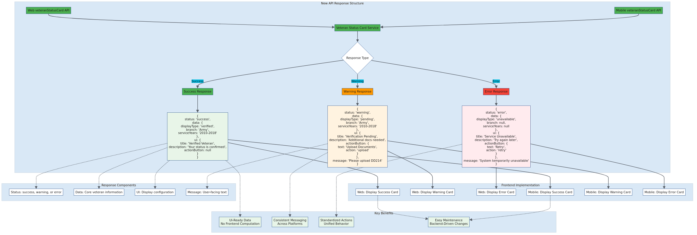

# API Response Structure

## Overview

This diagram details the new standardized response format that the unified `/veteranStatusCard` endpoint will return, including success, warning, and error states with corresponding UI-ready data.

## Response Structure Details

### **Response Types**

The API returns three primary response types, each with specific data structures:

#### **Success Response**
- **Status**: `success`
- **Data**: Complete veteran information (branch, service years)
- **UI**: Ready-to-display title, description, and actions
- **Use Case**: Verified veteran status with all required data

#### **Warning Response**
- **Status**: `warning`
- **Data**: Partial veteran information available
- **UI**: Warning message with actionable steps
- **Message**: Specific guidance for user (e.g., "Please upload DD214")
- **Use Case**: Verification pending, additional documentation needed

#### **Error Response**
- **Status**: `error`
- **Data**: Minimal or null information
- **UI**: Error state with retry options
- **Message**: System error or service unavailable
- **Use Case**: Technical issues, service down, or data unavailable

### **Key Benefits**

1. **UI-Ready Data**: No frontend computation required
2. **Consistent Messaging**: Standardized across platforms
3. **Standardized Actions**: Unified behavior for buttons and interactions
4. **Easy Maintenance**: Backend-driven changes without frontend updates

### **Response Components**

Each response includes:
- **Status**: Indicates success, warning, or error state
- **Data**: Core veteran information (when available)
- **UI**: Display configuration with titles, descriptions, and actions
- **Message**: User-facing text for warning and error states

## Architecture Diagram

## Diagram Source

View the [Mermaid source file](./api-response-structure.mmd) to see the code or make modifications.

## Implementation Notes

This response structure ensures that both web and mobile frontends can render consistent user experiences without any platform-specific logic. The UI section provides everything needed for display, while the data section contains the underlying information for any additional processing needs.