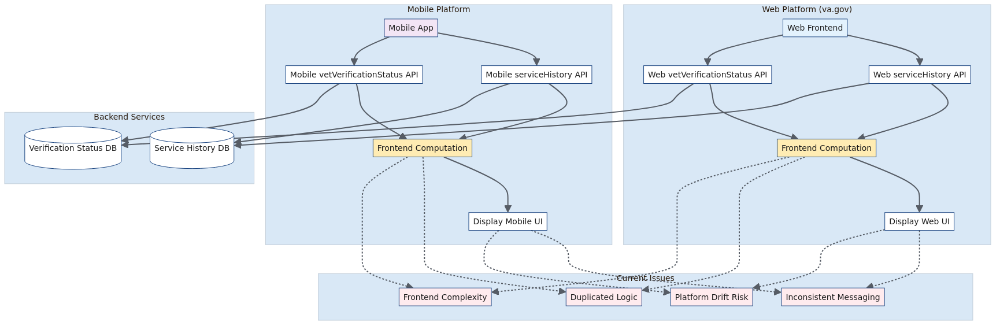

# Current Architecture

## Overview

This diagram illustrates the existing implementation of the Veteran Status Card feature, showing the parallel but separate architectures for web and mobile platforms.

## Architecture Details

The current implementation demonstrates several architectural challenges:

### **Web Platform (va.gov)**
- Makes separate API calls to `serviceHistory` and `vetVerificationStatus` endpoints
- Performs frontend computation to determine display logic
- Handles error messaging and user experience in the browser

### **Mobile Platform**
- Calls similar but distinct mobile-specific APIs
- Implements its own frontend computation logic
- Uses hardcoded messaging based on `notConfirmedReason`
- Ignores API messaging in favor of local logic

### **Current Issues Highlighted**
1. **Duplicated Logic**: Both platforms implement similar business logic separately
2. **Inconsistent Messaging**: Different error handling and user communication
3. **Frontend Complexity**: Complex computation logic in client applications
4. **Platform Drift Risk**: Separate implementations may diverge over time

## Architecture Diagram

## Diagram Source

View the [Mermaid source file](./current-architecture.mmd) to see the code or make modifications.

## Next Steps

This current architecture sets the stage for understanding why a unified backend service approach would be beneficial. See the [Proposed Architecture](./proposed-architecture.md) for the solution approach.