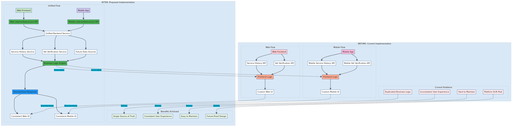

# Data Flow Comparison

## Overview

This diagram provides a side-by-side comparison of the current implementation versus the proposed refactor, clearly illustrating the transformation and benefits of the new architecture.

## Comparison Details

### **BEFORE: Current Implementation**

**Web Flow:**
- Frontend makes multiple API calls
- Complex business logic in browser
- Custom error handling per platform
- Inconsistent user experience

**Mobile Flow:**
- Similar but separate API endpoints
- Duplicated business logic
- Hardcoded messaging logic
- Platform-specific implementations

**Problems:**
- Duplicated business logic across platforms
- Inconsistent user experience
- Hard to maintain and test
- Risk of platform drift over time

### **AFTER: Proposed Implementation**

**Unified Flow:**
- Single API endpoint for both platforms
- Centralized business logic in backend
- Standardized response format
- Consistent user experience

**Benefits:**
- Single source of truth
- Consistent user experience
- Easy to maintain and extend
- Future-proof design

## Transformation Highlights

The diagram shows clear transformation arrows demonstrating:

1. **Logic Consolidation**: Frontend computation → Unified backend service
2. **Response Standardization**: Custom platform UIs → Consistent rendering
3. **Problem Resolution**: Each current issue maps to a specific benefit
4. **Architectural Simplification**: Complex parallel flows → Clean unified flow

## Architecture Diagram

## Diagram Source

View the [Mermaid source file](./data-flow-comparison.mmd) to see the code or make modifications.

## Migration Path

This comparison diagram serves as a roadmap for the migration from current to proposed architecture. The transformation addresses each identified problem with a corresponding solution, making the business case clear for the refactor.