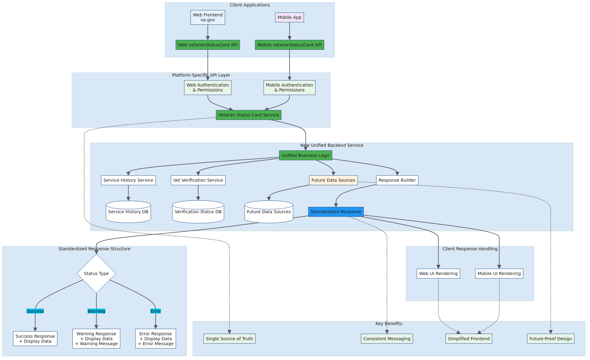

# Proposed Architecture

## Overview

This diagram presents the new unified backend service architecture that addresses the current implementation challenges through centralized business logic and standardized responses.

## Architecture Details

The proposed architecture introduces a fundamental shift from frontend computation to backend-driven logic:

### **New Unified Backend Service**
- **Single API Endpoint**: `/veteranStatusCard` serves both web and mobile
- **Veteran Status Card Service**: Centralized business logic processing
- **Unified Business Logic**: All computation happens in the backend
- **Multiple Data Sources**: Service History, Vet Verification, and future sources
- **Standardized Response Builder**: Consistent output format

### **Client Applications**
- **Web Frontend**: Simplified to render backend-provided data
- **Mobile App**: Same simplified approach, ensuring consistency
- **No Frontend Computation**: Clients become presentation layers

### **Key Benefits Achieved**
1. **Single Source of Truth**: All business logic centralized
2. **Consistent Messaging**: Unified error handling and user communication
3. **Simplified Frontend**: Clients focus on presentation
4. **Future-Proof Design**: Easy to add new data sources and logic

### **Extensibility**
- **Future Data Sources**: Architecture easily accommodates new data inputs
- **Standardized Response**: Consistent format allows for easy client updates
- **Backend-Driven**: Changes don't require frontend deployments

## Architecture Diagram

## Diagram Source

View the [Mermaid source file](./proposed-architecture.mmd) to see the code or make modifications.

## Implementation

This architecture represents the target state for the Veteran Status Card refactor. See the [Data Flow Comparison](./data-flow-comparison.md) to understand the transformation from current to proposed state.