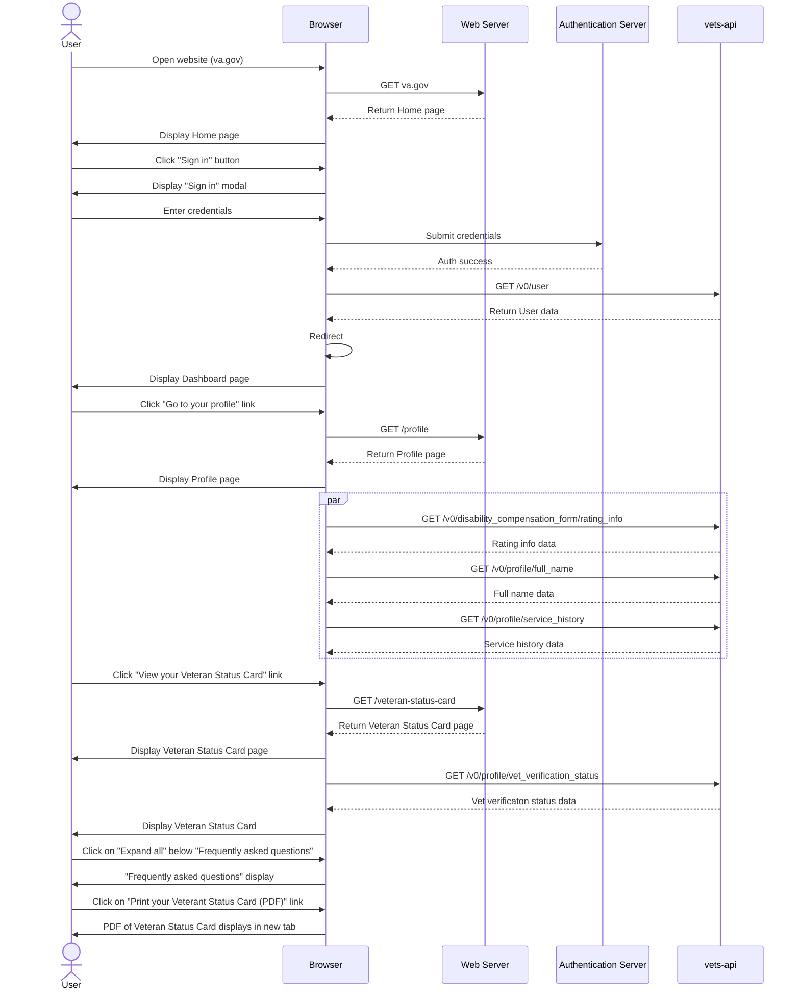

```mermaid
sequenceDiagram
    actor User
    participant Browser
    participant WebServer as Web Server
    participant AuthenticationServer as Authentication Server
    participant vets-api
    User->>Browser: Open website (va.gov)
    Browser->>WebServer: GET va.gov
    WebServer-->>Browser: Return Home page
    Browser->>User: Display Home page
    User->>Browser: Click "Sign in" button
    Browser->>User: Display "Sign in" modal
    User->>Browser: Enter credentials
    Browser->>AuthenticationServer: Submit credentials
    AuthenticationServer-->>Browser: Auth success
    Browser->>vets-api: GET /v0/user
    vets-api-->>Browser: Return User data
    Browser->>Browser: Redirect
    Browser->>User: Display Dashboard page
    User->>Browser: Click "Go to your profile" link
    Browser->>WebServer: GET /profile
    WebServer-->>Browser: Return Profile page
    Browser->>User: Display Profile page
    par
        Browser->>vets-api: GET /v0/disability_compensation_form/rating_info
        vets-api-->>Browser: Rating info data
        Browser->>vets-api: GET /v0/profile/full_name
        vets-api-->>Browser: Full name data
        Browser->>vets-api: GET /v0/profile/service_history
        vets-api-->>Browser: Service history data
    end
    User->>Browser: Click "View your Veteran Status Card" link
    Browser->>WebServer: GET /veteran-status-card
    WebServer-->>Browser: Return Veteran Status Card page
    Browser->>User: Display Veteran Status Card page
        Browser->>vets-api: GET /v0/profile/vet_verification_status
        vets-api-->>Browser: Vet verificaton status data
    Browser->>User: Display Veteran Status Card
    User->>Browser: Click on "Expand all" below "Frequently asked questions"
    Browser->>User: "Frequently asked questions" display
    User->>Browser: Click on "Print your Veterant Status Card (PDF)" link
    Browser->>User: PDF of Veteran Status Card displays in new tab
```
